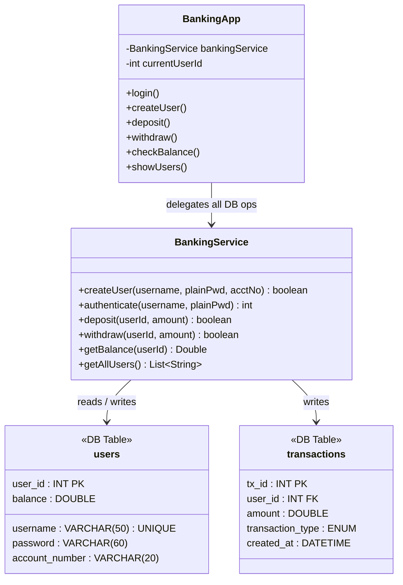

# Online Banking System

A Java Swing desktop application backed by **MySQL** for persistent storage,
**BCrypt** for secure password hashing, and **JUnit 5** for automated testing.

---

## Features

| Feature | Details |
|---------|---------|
| **User Registration** | Creates a new account; password is stored as a BCrypt hash (never plain text). |
| **Login / Authentication** | Verifies credentials against the stored BCrypt hash. All subsequent operations require a valid session. |
| **Deposit & Withdrawal** | Atomic MySQL transactions; withdrawal rejected if balance is insufficient. |
| **Balance Enquiry** | Real-time balance from the database. |
| **User Listing** | All users ordered by ID ascending. |
| **Thread-Safety** | All `BankingService` public methods are `synchronized` (see [Concurrency](#concurrency)). |

---

## Architecture



---

## Project Structure

```
Online-Banking-System/
├── pom.xml                          ← Maven build (Java 11, JUnit 5, BCrypt)
├── schema_update.sql                ← Run once: widens password column to VARCHAR(60)
├── src/
│   ├── main/java/bank/
│   │   ├── BankingApp.java          ← Swing UI (no JDBC here)
│   │   └── BankingService.java      ← All DB logic + BCrypt
│   └── test/java/bank/
│       └── BankingServiceTest.java  ← JUnit 5 integration tests
```

---

## Prerequisites

| Tool | Version |
|------|---------|
| Java JDK | 11+ |
| Maven | 3.8+ |
| MySQL | 8.0+ |

---

## Setup

### 1 – Database

```sql
CREATE DATABASE IF NOT EXISTS online_banking;
USE online_banking;
SOURCE schema_update.sql;
```

Or run the migration directly:

```bash
mysql -u root -p online_banking < schema_update.sql
```

### 2 – Configuration

DB credentials are in `BankingService.java`:

```java
private static final String URL      = "jdbc:mysql://localhost:3306/online_banking";
private static final String USER     = "root";
private static final String PASSWORD = "7419";
```

Change these if your MySQL setup differs.

### 3 – Build

```bash
mvn clean package
```

This compiles, runs tests, and produces `target/online-banking-system-1.0-SNAPSHOT.jar`.

### 4 – Run

```bash
java -jar target/online-banking-system-1.0-SNAPSHOT.jar
```

---

## Running Tests

```bash
mvn test
```

The test suite (`BankingServiceTest`) covers:

| Test | What it verifies |
|------|-----------------|
| `testCreateUser_success` | User created; password stored as BCrypt hash (starts with `$2`, length 60). |
| `testCreateUser_duplicateFails` | Duplicate username returns `false`. |
| `testAuthenticate_success` | Correct credentials return a positive user ID. |
| `testAuthenticate_wrongPassword` | Wrong password returns `-1`. |
| `testAuthenticate_unknownUser` | Unknown username returns `-1`. |
| `testDeposit` | Balance increases by deposited amount. |
| `testDeposit_invalidAmount` | Zero / negative deposits are rejected. |
| `testWithdraw` | Balance decreases by withdrawn amount. |
| `testWithdraw_insufficientFunds` | Withdraw fails and balance stays unchanged. |
| `testGetBalance_unknownUser` | Returns `null` for a non-existent user ID. |
| `testGetAllUsers` | List is non-empty and contains the test user. |
| `testGetAllUsers_ordering` | Users are returned in ascending `user_id` order. |

> **Note:** The integration tests require a live MySQL connection. Make sure MySQL
> is running before executing `mvn test`.

---

## Concurrency

All public methods in `BankingService` are declared **`synchronized`**:

```java
public synchronized boolean deposit(int userId, double amount) { … }
public synchronized boolean withdraw(int userId, double amount) { … }
// … and so on for createUser, authenticate, getBalance, getAllUsers
```

This means:
- Only **one thread** can execute a DB operation at a time, preventing dirty reads and lost updates.
- Swing's Event Dispatch Thread fires action listeners sequentially, but if you later expose the service to multiple concurrent clients (e.g., via a REST layer), the `synchronized` keyword ensures safe serialised access.
- For high-throughput scenarios, replace the coarse-grained `synchronized` with a `java.util.concurrent.locks.ReentrantLock` per user, or migrate to a connection pool (HikariCP) with DB-level transactions for optimistic locking.

---

## Password Security

| Aspect | Implementation |
|--------|---------------|
| Algorithm | **BCrypt** (`org.mindrot:jbcrypt:0.4`) |
| Work factor | Default (`BCrypt.gensalt()` = 10 rounds) |
| Storage | `VARCHAR(60)` – BCrypt hashes are always exactly 60 characters |
| Verification | `BCrypt.checkpw(plain, storedHash)` – constant-time comparison |
| Plain text | **Never stored** – only the hash is persisted |

---

## Dependencies

| Dependency | Version | Purpose |
|------------|---------|---------|
| `mysql:mysql-connector-java` | 8.0.33 | MySQL JDBC driver |
| `org.mindrot:jbcrypt` | 0.4 | BCrypt password hashing |
| `org.junit.jupiter:junit-jupiter-api` | 5.10.0 | JUnit 5 test API |
| `org.junit.jupiter:junit-jupiter-engine` | 5.10.0 | JUnit 5 Maven runner |
